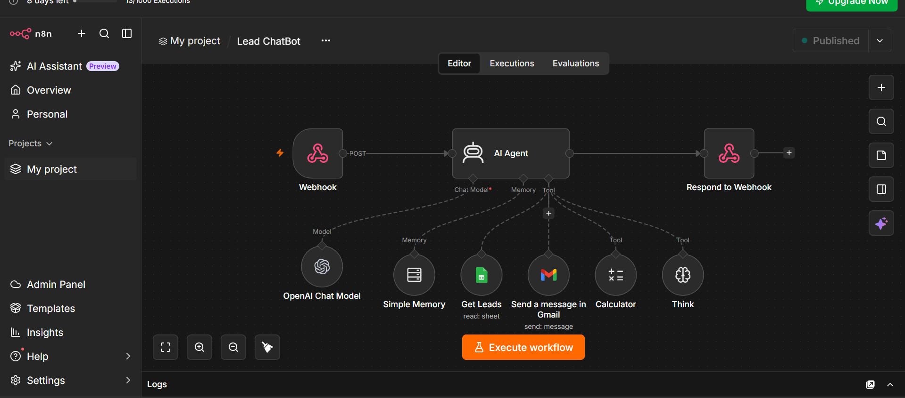
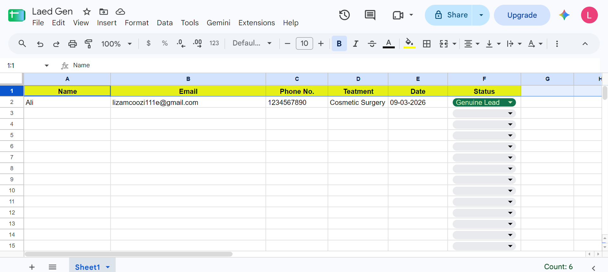
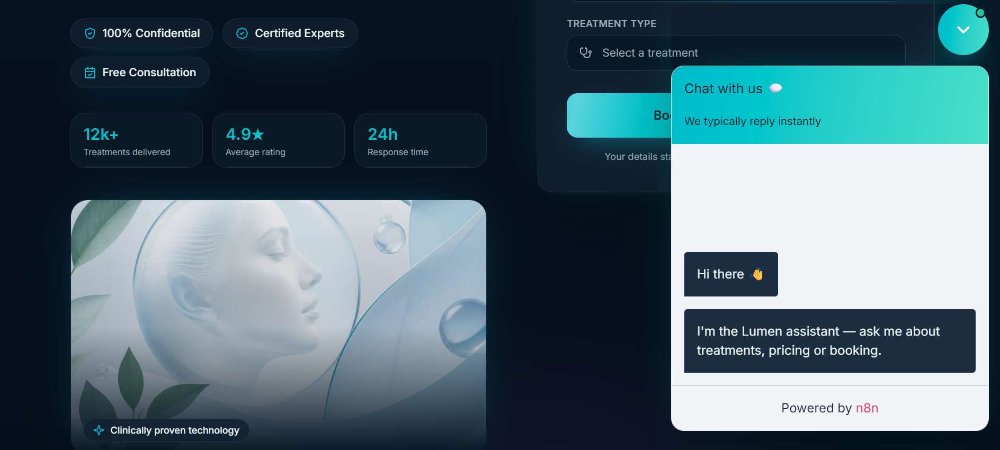

# Lead Generation Chatbot — n8n Workflow

An intelligent lead management chatbot built with n8n that lets your team instantly view, filter, and share lead data from a connected Google Sheet — all through a conversational AI interface embedded directly on your website.

---

## What It Does

```
Visitor fills booking form on website
              ↓
     Lead saved to Google Sheet
              ↓
   Team chats with AI Assistant
              ↓
       ┌──────┴──────┐
       ↓             ↓
  View & filter   Send styled
  leads in chat   HTML report
                  via Gmail
```

**No dashboard juggling. No manual exports. Just ask and get answers.**

---

## Features

| Feature | Description |
|---|---|
| **View Leads** | Ask the bot to show all leads, filtered by status, treatment type, or date |
| **Genuine / Fake Classification** | Each lead is tagged — bot counts and reports both accurately |
| **Email Report** | Send a beautifully formatted HTML leads report to any email on request |
| **Accurate Counting** | Think + Calculator tools ensure zero miscounts, even on large datasets |
| **Conversation Memory** | Remembers context across the session (last 25 messages) |
| **Date-Safe** | Always uses real runtime dates — never hardcoded placeholders |

---

## Lead Data Fields

| Field | Description |
|---|---|
| `Name` | Full name of the lead |
| `Email` | Lead's email address |
| `Phone No.` | Contact number |
| `Treatment` | Type of treatment selected (e.g., Cosmetic Surgery, Hair Treatment) |
| `Date` | Date the lead was submitted |
| `Status` | `Genuine Lead` or `Fake Lead` |

---

## Tech Stack

| Tool | Purpose |
|---|---|
| n8n | Workflow automation & agent orchestration |
| OpenAI GPT-4o-mini | Conversational AI & reasoning |
| Google Sheets | Lead data storage |
| Gmail | Automated HTML email reports |
| n8n Think Tool | Step-by-step reasoning before counting |
| n8n Calculator Tool | Verified numeric counting — no hallucinated totals |

---

## Workflow Overview

```
[Webhook] → [AI Agent] → [Respond to Webhook]
                ↑
     ┌──────────┼──────────────┬────────────┐
     ↓          ↓              ↓            ↓
[OpenAI    [Simple       [Get Leads]   [Send Email]
 Model]     Memory]      (G. Sheets)   (Gmail)
                              
                         [Calculator] [Think]
```

**9 nodes. Fully automated. Runs 24/7.**

---

## Setup

### 1. Import Workflow
Open n8n → **Import from file** → select `workflow.json`

### 2. Add Credentials

| Credential | Where to get |
|---|---|
| OpenAI API Key | [platform.openai.com](https://platform.openai.com) |
| Gmail OAuth2 | Google Cloud Console |
| Google Sheets OAuth2 | Google Cloud Console |

### 3. Configure Nodes

**Get Leads node:**
- Connect your Google Sheets OAuth2 credential
- Create a new sheet (or use existing) with these exact columns:
```
Name | Email | Phone No. | Treatment | Date | Status
```
- Copy the Sheet ID from the URL and paste it in the node
- Set `Status` column as a dropdown with values: `Genuine Lead` / `Fake Lead`

**Send Email node (Gmail):**
- Connect your Gmail OAuth2 credential
- Update `senderName` to your preferred display name

**Webhook node:**
- Copy the webhook URL after activating — use this to connect your frontend chatbot

### 4. Activate
Toggle the workflow **Active** in n8n → embed the webhook URL in your website's chat widget → start chatting.

---

## Example Conversations

> **User:** Show me all leads  
> **Bot:** Fetches sheet → displays a clean table of all leads with status badges

> **User:** How many genuine leads do we have?  
> **Bot:** Uses Think + Calculator → returns a verified count

> **User:** Email the full report to manager@company.com  
> **Bot:** Sends a styled HTML email with stat cards and a zebra-striped lead table

---

## Screenshots







---

## Demo Video

**Demo Video is available on LinkedIn**
- https://www.linkedin.com/posts/muhammad-farhan-automation-expert_n8n-ai-automation-activity-7504452539690516480-yhcJ?utm_source=share&utm_medium=member_desktop&rcm=ACoAAGz7OncBrF9aAry5leKa0S7nGoANBw7vWbk
---

## Use Cases

- **Aesthetics & wellness clinics** — track and qualify patient booking leads automatically
- **Sales teams** — get instant lead snapshots without opening spreadsheets
- **Marketing agencies** — share live lead reports with clients via email on demand
- **Small businesses** — replace manual lead review with a conversational interface

---

## License

MIT — free to use and modify.
